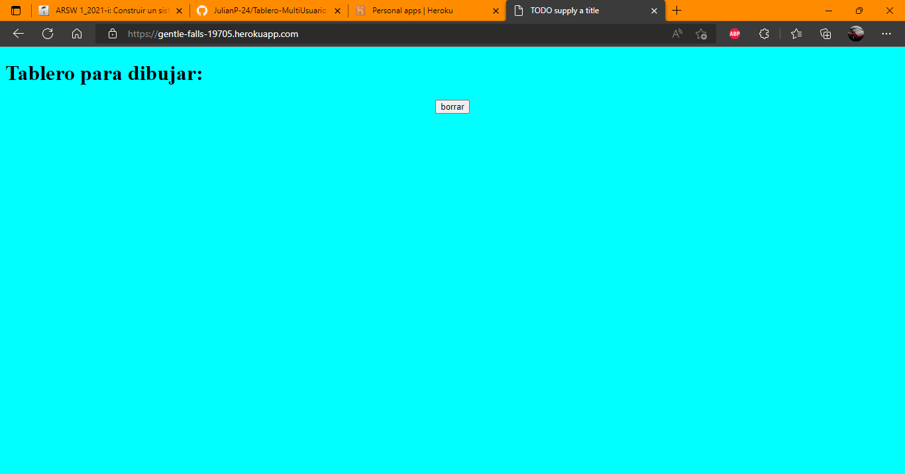
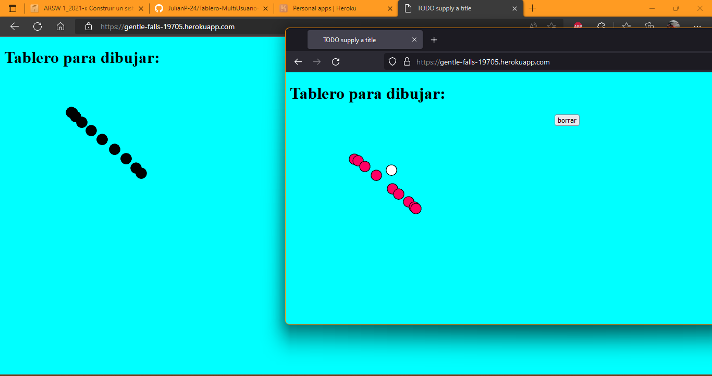
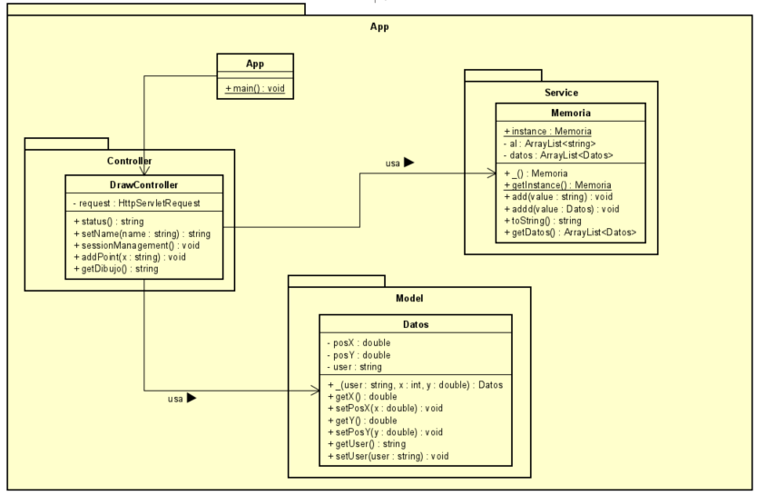

# Tarea ARSW Inter (Tablero Multiusuario React)

## Autor
**Julian Adolfo Peña Marin**

## Descripcion
La aplicacion es el famoso juego de Picas y Famas, en su version web, en donde se tiene como objetivo adivinar una lista de 4 numeros. El funcionamiento es sencillo y va de la siguiente manera:

 * El usuario ingresara un numero de 4 digitos.
 * Una vez ingresado se compara cada digito que el usuario ingreso con otro numero generado aleatoriamente.
 * Si el numero esta pero en posicion diferente es pica, pero si el numero esta en la misma posicion es Fama.
 * Dependiendo de cual sea se va aumentando un contador, el usuario solamente gana si logra adivinar el numero, es decir si consigue 4 famas.
 * Adicionalmente el usuario tiene 6 intentos, si no lo logra en los 6, perdera el juego.

## Documentacion
Para obtener la documentacion del proyecto, con el siguiente comando se puede generar:

```
    mvn javadoc:javadoc
```

## Como Correrlo
Primero se debe clonar el repositorio, para esto puede utilizar el siguiente comando de git, con la url del repositorio que se quiere clonar, como se muestra a continuación

```
    git clone https://github.com/JulianP-24/Lab-PicasFamas-Inter-Arsw.git
```

Una vez clonado para generar el JAR, debe poner el siguiente comando

```
    mvn package
```

Despues puede correrlo con el siguiente comando, ubicandose en la carpeta raiz
```
    java -cp "./target/classes/" edu.escuelaing.arsw.picasYfamas.PicasYfamasApplication
```

Otra forma para correrlo, ya generado el JAR, es con el siguiente comando

```
    java -cp "target/picasYfamas-0.0.1-SNAPSHOT.jar" edu.escuelaing.arsw.picasYfamas.PicasYfamasApplication
```
y sino corre, la aplicacion tambien se puede probar con el link de heroku

## Link heroku

https://immense-reaches-02811.herokuapp.com/

## Funcionamiento de la Aplicacion en Heroku

Para verificar el funcionamiento de la aplicacion en Heroku, solo se accede al link de heroku, mostrado anteriormente, como se muestra a continuacion:

```
    https://immense-reaches-02811.herokuapp.com/
```

Como resultado se obtiene una pagina de bienvenida, con un boton para jugar



una vez se le da click al boton jugar, muestra la ventana del juego con un campo de texto



En el campo de texto el usuario ingresa el numero de 4 cifras y empieza el juego, como se muestra a continuacion


El jugador sigue ingresando numeros, hasta que consiga ganar.


## Diagrama de Clases
A continuacion se presenta el diagrama de clases de la arquitectura para la tarea propuesta




## Built con

* [Maven](https://maven.apache.org/) - Dependency Management
* [JAVA JDK 8](http://www.oracle.com/technetwork/java/javase/overview/index.html) - construcción


## Licencia

This project is licensed under the GNU General Public License - see the [LICENSE](LICENSE) file for details

